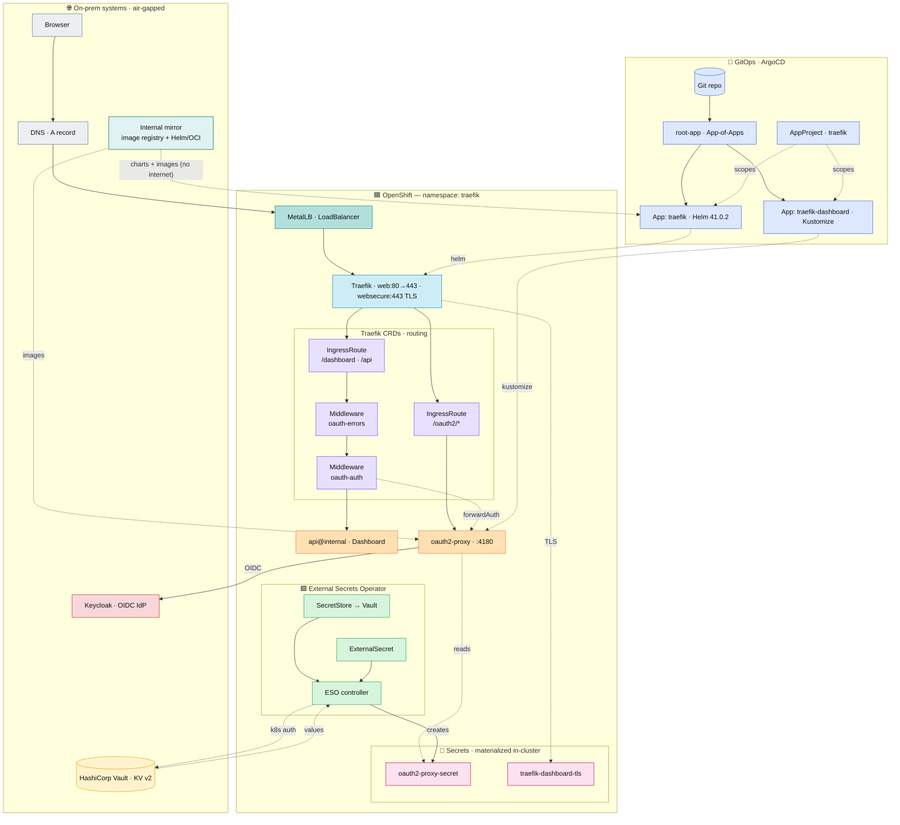
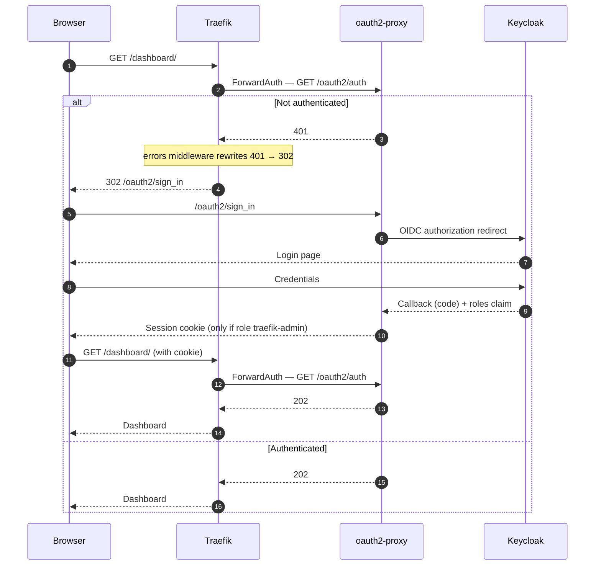

# Traefik on OpenShift 4.20+ with a Keycloak-protected dashboard (GitOps/ArgoCD)

<!-- Repository / meta badges -->
<p align="center">
  <a href="https://github.com/nubenetes/traefik-keycloak-openshift-gitops/actions/workflows/ci.yml"></a>
  <a href="LICENSE"></a>
  
  
  
  
  <a href="https://github.com/nubenetes/traefik-keycloak-openshift-gitops/issues"></a>
  <a href="https://github.com/nubenetes/traefik-keycloak-openshift-gitops/stargazers"></a>
  <a href="https://github.com/nubenetes/traefik-keycloak-openshift-gitops/network/members"></a>
  <a href="https://github.com/nubenetes/traefik-keycloak-openshift-gitops/watchers"></a>
  
  
  <a href="https://github.com/nubenetes/traefik-keycloak-openshift-gitops/pulls"></a>
  
  
  
  
  <a href="https://github.com/apps/renovate"></a>
  
  
</p>

<!-- Tech-stack badges -->
<p align="center">
  
  
  
  
  
  
  
  
  
  
  
  
  
  
  
  
</p>

> ⚠️ **AI-generated & untested — read before using.**
> This repository was **generated by Claude** (Anthropic's Claude Code, Opus 4.8)
> while reviewing and refactoring an existing project into a GitOps layout.
> It has **not been deployed or tested on a real OpenShift / ArgoCD cluster**.
> Validation so far is limited to `kustomize build` and offline YAML checks —
> **no live apply, no end-to-end auth flow has been exercised.**
> Treat it as a reviewed starting point: read every manifest, replace the dummy
> values, and validate in a non-production environment before any real use.

Reference deployment of the **official Traefik Helm chart** exposed through
**MetalLB (LoadBalancer)**, with the **Traefik dashboard authenticated against
Keycloak** via **oauth2-proxy + ForwardAuth** and **restricted by role**
(`traefik-admin`).

> 🏢🔌 **Target platform: on-premises, disconnected (air-gapped) OpenShift
> Container Platform (OCP 4.20+).** There is **no internet egress** — hence
> **MetalLB** for load-balancing (no cloud LoadBalancer), and **internal mirrors**
> for Helm charts, container images and Operators. Keycloak, Vault and DNS are
> all **internal/on-prem**, and TLS uses an **internal CA** (no ACME/Let's
> Encrypt). See [§10 Air-gapped](#10-air-gapped--disconnected-on-prem) and
> [`docs/air-gapped.md`](docs/air-gapped.md).

Ships two delivery paths that share the same manifests and values:

- **GitOps with ArgoCD** (recommended): `argocd/` — App-of-Apps pattern.
- **Imperative** (no ArgoCD): `install.sh`.

## Table of contents

1. [Architecture](#1-architecture)
2. [Repository layout](#2-repository-layout)
3. [Prerequisites](#3-prerequisites)
4. [Configuration](#4-configuration) — variables, secrets, TLS, Keycloak
5. [Step-by-step install](#5-step-by-step-install)
6. [Upgrade](#6-upgrade)
7. [Decommission (uninstall)](#7-decommission-uninstall)
8. [Operations & troubleshooting](#8-operations--troubleshooting)
9. [GitOps with ArgoCD](#9-gitops-with-argocd)
10. [Air-gapped / disconnected (on-prem)](#10-air-gapped--disconnected-on-prem)

---

## 1. Architecture

<details>
<summary><b>🗺️ Full architecture — delivery (GitOps) + runtime, all components (click to expand)</b></summary>



</details>

**Legend**

| | Group | What it covers |
|---|---|---|
| 🟦 | Ingress / proxy | MetalLB · Traefik |
| 🟪 | Traefik CRDs | IngressRoutes · middlewares |
| 🟧 | Apps | oauth2-proxy · dashboard |
| 🟩 | External Secrets Operator | SecretStore · ExternalSecret · controller |
| 🩷 | Secrets | materialized in-cluster |
| 🔁 | GitOps | git repo · ArgoCD |
| 🟨 | Vault | HashiCorp Vault · KV v2 |
| 🟥 | Keycloak | OIDC IdP |
| 🟢 | Internal mirror | image registry + Helm/OCI |
| ⬜ | Client / DNS | browser · DNS record |

**Arrows:** solid = request/data path · dotted = delivery, auth & references.

**Air-gapped:** all charts, images and operators come from the **internal mirror**
(no internet egress); MetalLB provides the on-prem LoadBalancer.

<details>
<summary><b>🔐 Authentication flow — ForwardAuth + OIDC (click to expand)</b></summary>



</details>

**Why each piece:**

- **Traefik OSS has no native OIDC.** `oauth2-proxy` performs the OIDC exchange
  with Keycloak; Traefik only asks "is this request authenticated?" through the
  `ForwardAuth` middleware against `/oauth2/auth`.
- The **`errors` middleware with `statusRewrites: "401": 302`** turns the 401
  into a real redirect to Keycloak. **Requires Traefik ≥ v3.4.** Without it you
  would see a blank 401 instead of the login screen.
- **Role restriction:** the `keycloak-oidc` provider reads the token roles;
  `OAUTH2_PROXY_ALLOWED_ROLES=traefik-dashboard:traefik-admin` only lets in users
  who hold that role.

---

## 2. Repository layout

```
argocd/                                    GitOps delivery (ArgoCD / OpenShift GitOps)
  project.yaml                             AppProject 'traefik' (scopes repos/dest/resources)
  root-app.yaml                            App-of-Apps root (applied once)
  apps/traefik.yaml                        Application (Helm) chart 41.0.2 + values     [wave 0]
  apps/traefik-dashboard.yaml              Application (Kustomize) manifests/            [wave 1]
  README.md                                GitOps bootstrap guide
helm/values-traefik.yaml                   Official chart values (OpenShift/MetalLB)
manifests/                                 Kustomize base of the raw manifests
  kustomization.yaml                       Applied resources (no Namespace, no Secrets)
  oauth2-proxy/deployment.yaml             oauth2-proxy (keycloak-oidc provider)
  oauth2-proxy/service.yaml                Service :4180
  oauth2-proxy/trusted-ca-configmap.yaml   Trusted CA for the Keycloak cert (optional)
  dashboard/middlewares.yaml               oauth-auth (ForwardAuth) + oauth-errors
  dashboard/ingressroute-oauth2.yaml       Route /oauth2/* → oauth2-proxy
  dashboard/ingressroute-dashboard.yaml    Route /dashboard + /api → api@internal
  vault/                                   HashiCorp Vault + ESO (recommended secrets path)
    serviceaccount.yaml                    SA for ESO → Vault (Kubernetes auth)
    secretstore.yaml                       SecretStore → Vault (KV v2)
    externalsecret-oauth2-proxy.yaml       ExternalSecret → oauth2-proxy-secret
    externalsecret-dashboard-tls.yaml      ExternalSecret → traefik-dashboard-tls (optional)
secrets/oauth2-proxy-secret.example.yaml   Secret template (out-of-band alternative)
air-gapped/imagedigestmirrorset.example.yaml  Redirect image pulls to the internal registry
docs/tls-secret.md                         How to create the traefik-dashboard-tls cert
docs/vault-external-secrets.md             Vault + ESO setup (recommended secrets path)
docs/air-gapped.md                         Disconnected/on-prem: mirror charts, images, operators
keycloak/keycloak-client-setup.md          How to create the client in Keycloak
metallb/ipaddresspool.example.yaml         MetalLB pool (on-prem LoadBalancer)
install.sh                                 Imperative deployment (ArgoCD alternative)
README.md                                  This manual
```

> **Namespace:** there is no standalone `namespace.yaml`. Under GitOps the
> `traefik` Application creates and labels it (PSA `restricted`) via
> `managedNamespaceMetadata`; in imperative mode `install.sh` creates it.

---

## 3. Prerequisites

| Requirement | Check |
|---|---|
| OpenShift 4.20+ with an active session | `oc whoami` |
| `helm` v3 CLI (imperative path only) | `helm version` |
| **MetalLB Operator** with a pool | `oc get ipaddresspools -A` |
| **Keycloak** reachable over HTTPS | open its console |
| Permission to create namespaces + CRDs | `cluster-admin` or equivalent |
| Manageable **internal** DNS for `traefik.apps.example.com` | will point to the MetalLB IP |
| For GitOps: **ArgoCD ≥ 2.6** (OpenShift GitOps ≥ 1.8) | multi-source + managedNamespaceMetadata |
| **Air-gapped:** internal image registry + Helm/OCI mirror | see [§10](#10-air-gapped--disconnected-on-prem) / `docs/air-gapped.md` |
| **Air-gapped:** MetalLB & External Secrets Operators mirrored to a disconnected catalog | `oc-mirror` |

> No MetalLB pool yet? Edit and apply `metallb/ipaddresspool.example.yaml`.
> On a disconnected cluster, **mirror everything first** — see §10.

---

## 4. Configuration

Done **once** before installing. Three blocks: variables, secrets and TLS. In
parallel, the Keycloak client.

### 4.1 Variables (dummy values)

The files **ship with coherent, valid dummy values** so the deployment boots as
is. Replace them with yours. Find them with:

```bash
grep -rn 'traefik.apps.example.com\|keycloak.apps.example.com\|myrealm\|apps.example.com\|dummy-client-secret' .
```

| Current dummy | Files | What it is | Replace with (example) |
|---|---|---|---|
| `traefik.apps.example.com` | manifests/oauth2-proxy/deployment, manifests/dashboard/*, keycloak/*, tls | Public dashboard host | `traefik.apps.mydomain.com` |
| `keycloak.apps.example.com` | manifests/oauth2-proxy/deployment, keycloak/* | Keycloak Route host | `keycloak.apps.mydomain.com` |
| `myrealm` | manifests/oauth2-proxy/deployment, keycloak/* | Keycloak realm | `platform` |
| `.apps.example.com` | manifests/oauth2-proxy/deployment (COOKIE/WHITELIST_DOMAINS) | Cookie domain | `.apps.mydomain.com` |
| `dummy-client-secret-REPLACE` | secrets/oauth2-proxy-secret | Keycloak client secret | (client Credentials) |
| dummy cookie secret | secrets/oauth2-proxy-secret | Cookie secret | `openssl rand -base64 32 \| tr '+/' '-_'` |
| `192.168.1.240-192.168.1.250` | metallb/ipaddresspool | MetalLB range | your real range |

**Quick one-shot substitution** (adjust the target values). Because
`keycloak.apps.example.com` and `traefik.apps.example.com` share the suffix
`.apps.example.com`, replace the full hosts first, then the domain:

```bash
# Linux/macOS or Git Bash. Order matters (host before domain).
grep -rl 'traefik.apps.example.com'  . | xargs sed -i 's/traefik\.apps\.example\.com/traefik.apps.mydomain.com/g'
grep -rl 'keycloak.apps.example.com' . | xargs sed -i 's/keycloak\.apps\.example\.com/keycloak.apps.mydomain.com/g'
grep -rl 'myrealm'                   . | xargs sed -i 's/myrealm/platform/g'
grep -rl '\.apps\.example\.com'      . | xargs sed -i 's/\.apps\.example\.com/.apps.mydomain.com/g'
```

Edit the secret (`secrets/oauth2-proxy-secret.yaml`) by hand (see 4.2), not with sed.

> **Keycloak issuer:** Keycloak 17+ uses `…/realms/<realm>`. Legacy Keycloak
> (with `/auth`) uses `…/auth/realms/<realm>`. Verify the real one by opening
> `…/realms/<realm>/.well-known/openid-configuration`.

### 4.2 Secrets

```bash
# 1) Cookie secret (32 bytes)
openssl rand -base64 32 | tr -- '+/' '-_'

# 2) Copy the template and edit it
cp secrets/oauth2-proxy-secret.example.yaml secrets/oauth2-proxy-secret.yaml
```

In `secrets/oauth2-proxy-secret.yaml` fill in:
- `OAUTH2_PROXY_CLIENT_SECRET` → the Keycloak client secret (step 4.4).
- `OAUTH2_PROXY_COOKIE_SECRET` → the string generated above.

> **Do not** commit `secrets/oauth2-proxy-secret.yaml` (already in `.gitignore`).
> The recommended alternative keeps **no secret in git**: HashiCorp Vault + the
> External Secrets Operator — see §9.1 and `docs/vault-external-secrets.md`.

### 4.3 Dashboard TLS certificate

With MetalLB, **Traefik terminates TLS** (there is no OpenShift Route in front),
so the `traefik-dashboard-tls` Secret is required. Pick an option from
`docs/tls-secret.md` (cert-manager, own cert, or self-signed). Own-cert example:

```bash
oc create secret tls traefik-dashboard-tls -n traefik --cert=tls.crt --key=tls.key
```

### 4.4 Keycloak client

Follow `keycloak/keycloak-client-setup.md`. Summary:
1. Confidential client `traefik-dashboard`, Standard flow ON.
2. Valid redirect URI: `https://traefik.apps.example.com/oauth2/callback`.
3. Copy the **Client secret** → goes into `secrets/oauth2-proxy-secret.yaml`.
4. Create the client role **`traefik-admin`** and assign it to the users allowed
   in (no role assigned → 403 after login).

---

## 5. Step-by-step install

With the configuration from section 4 done. Pick **one** path.

### 5.A — GitOps with ArgoCD (recommended)

Declarative, auto-sync + self-heal. Full guide in
[`argocd/README.md`](argocd/README.md). Summary:

```bash
# 1) Adjust the ArgoCD namespace (and targetRevision) in argocd/*.yaml
# 2) Create the secrets out-of-band (ArgoCD does not manage them):
oc create namespace traefik
oc apply -f secrets/oauth2-proxy-secret.yaml
oc create secret tls traefik-dashboard-tls -n traefik --cert=tls.crt --key=tls.key
# 3) (Optional) MetalLB pool if you don't have one: oc apply -f metallb/ipaddresspool.example.yaml
# 4) Bootstrap the AppProject and the App-of-Apps (once):
oc apply -n openshift-gitops -f argocd/project.yaml
oc apply -n openshift-gitops -f argocd/root-app.yaml
```

ArgoCD creates the namespace (with the PSA label), installs Traefik + CRDs
(wave 0), then oauth2-proxy + middlewares + routes (wave 1). Track it with
`argocd app get traefik` / `traefik-dashboard`.

### 5.B — Imperative (no ArgoCD)

Use `./install.sh` (applies everything in order) or do it manually:

**Step 1 — Namespace**
```bash
oc create namespace traefik
oc label namespace traefik pod-security.kubernetes.io/enforce=restricted --overwrite
```

**Step 2 — (Optional) MetalLB pool**
```bash
oc apply -f metallb/ipaddresspool.example.yaml   # only if you don't have a pool yet
```

**Step 3 — Traefik (official chart, pinned version)**
```bash
helm repo add traefik https://traefik.github.io/charts
helm repo update
helm upgrade --install traefik traefik/traefik --version 41.0.2 -n traefik -f helm/values-traefik.yaml
```

**Step 4 — TLS certificate** (if not created in 4.3)
```bash
oc create secret tls traefik-dashboard-tls -n traefik --cert=tls.crt --key=tls.key
```

**Step 5 — oauth2-proxy Secret**
```bash
oc apply -f secrets/oauth2-proxy-secret.yaml
```

**Step 6 — Dashboard manifests (oauth2-proxy + middlewares + routes)**
```bash
oc apply -k manifests/
```

**Step 7 — MetalLB IP and DNS**
```bash
oc get svc traefik -n traefik
# Copy EXTERNAL-IP and create the A record: traefik.apps.example.com -> that IP
```

**Step 8 — Verify**
```bash
oc get pods -n traefik            # traefik and oauth2-proxy Running
```
Open `https://traefik.apps.example.com/dashboard/` → redirects to Keycloak → log
in with a user holding the `traefik-admin` role → back to the dashboard.

---

## 6. Upgrade

> **With ArgoCD:** do not run `helm`/`oc apply` by hand. Edit the file in git
> (`helm/values-traefik.yaml`, `manifests/…`, or `targetRevision` in
> `argocd/apps/traefik.yaml`), commit + push and ArgoCD reconciles on its own.
> The commands below are for the **imperative** mode.

### 6.1 Upgrade Traefik (chart/version)

```bash
helm repo update
# Installed vs available versions
helm list -n traefik
helm search repo traefik/traefik --versions | head

# (Recommended) preview changes with diff if you have the helm-diff plugin
helm diff upgrade traefik traefik/traefik -n traefik -f helm/values-traefik.yaml

# Apply. Pin --version to control the version (keep Traefik >= v3.4).
helm upgrade traefik traefik/traefik -n traefik -f helm/values-traefik.yaml --version <X.Y.Z>

# Check the rollout
oc rollout status deploy/traefik -n traefik
```

> **CRDs:** the Traefik chart manages its CRDs. On big version jumps, check the
> release notes in case CRDs must be updated manually (`helm upgrade` does not
> always update pre-existing CRDs).

**Rollback if something fails:**
```bash
helm history traefik -n traefik
helm rollback traefik <REVISION> -n traefik
```

### 6.2 Upgrade oauth2-proxy

Change the image tag in `manifests/oauth2-proxy/deployment.yaml` (e.g. `v7.7.1`
→ new version) and apply:
```bash
oc apply -k manifests/
oc rollout status deploy/oauth2-proxy -n traefik
# rollback: oc rollout undo deploy/oauth2-proxy -n traefik
```

### 6.3 Change configuration (host, realm, roles, cookies)

```bash
# Edit the file(s) under manifests/ and reapply the whole Kustomize base:
#   manifests/oauth2-proxy/deployment.yaml   issuer, redirect, roles, cookies
#   manifests/dashboard/middlewares.yaml     forwardAuth / errors
#   manifests/dashboard/ingressroute-*.yaml  routes
oc apply -k manifests/

# If secrets change:
oc apply -f secrets/oauth2-proxy-secret.yaml
oc rollout restart deploy/oauth2-proxy -n traefik   # reload the new Secret
```

> Changing environment variables (deployment) restarts the pod on its own.
> Changing the **Secret** does NOT restart the pod automatically: use
> `rollout restart`.

---

## 7. Decommission (uninstall)

> **With ArgoCD:** just delete the root Application; the finalizer cascade-deletes
> the children and all their resources:
> `oc delete -n openshift-gitops application/traefik-root`.
> Then do the external cleanup in §7.3. The steps below are for imperative mode.

Reverse order. **Delete the whole namespace** (fast) or piece by piece (controlled).

### 7.1 Fast — delete the whole namespace

```bash
# Uninstall the Helm release first (also cleans its chart CRDs/RBAC)
helm uninstall traefik -n traefik

# Delete the rest (oauth2-proxy, middlewares, ingressroutes, secrets)
oc delete namespace traefik
```

### 7.2 Controlled — piece by piece

```bash
oc delete -k manifests/                                    # oauth2-proxy + middlewares + routes
oc delete -f secrets/oauth2-proxy-secret.yaml
oc delete secret traefik-dashboard-tls -n traefik

helm uninstall traefik -n traefik
oc delete namespace traefik
```

### 7.3 External cleanup (don't forget)

- **DNS:** remove the A record for `traefik.apps.example.com`.
- **MetalLB:** if you created a pool only for this, `oc delete -f metallb/ipaddresspool.example.yaml`.
- **Keycloak:** delete the `traefik-dashboard` client and the `traefik-admin` role.
- **Traefik CRDs:** `helm uninstall` usually does NOT delete the CRDs. To remove
  them entirely (⚠️ affects any other Traefik in the cluster!):
  ```bash
  oc get crd | grep traefik.io
  # oc delete crd <each-crd>.traefik.io
  ```

---

## 8. Operations & troubleshooting

```bash
# General status
oc get pods,svc -n traefik

# oauth2-proxy logs (OIDC, issuer, CA, roles)
oc logs -n traefik deploy/oauth2-proxy -f

# Traefik logs (CRDs, routing). Raise the level with --log.level=DEBUG in values.
oc logs -n traefik deploy/traefik | grep -i error
```

| Symptom | Likely cause | Fix |
|---|---|---|
| Blank 401 (no redirect) | Traefik < v3.4 or missing `oauth-errors` / middleware order | Use Traefik ≥ v3.4; order `[oauth-errors, oauth-auth]` |
| 403 after login | User without the `traefik-admin` role | Assign the role in Keycloak |
| Redirect loop | `COOKIE_DOMAINS`/`WHITELIST_DOMAINS` don't cover the host | Adjust to the dashboard domain |
| Invalid `redirect_uri` | Keycloak Valid redirect URI mismatch | Must be `https://traefik.apps.example.com/oauth2/callback` |
| `x509: unknown authority` | oauth2-proxy doesn't trust the Keycloak cert | `trusted-ca` ConfigMap + volumes, or `SSL_INSECURE_SKIP_VERIFY` (testing) |
| `invalid issuer` | issuer with/without `/auth` wrong | Check `.well-known/openid-configuration` |
| Service with no EXTERNAL-IP | MetalLB without pool or L2Advertisement | Check `metallb/ipaddresspool.example.yaml` |
| Traefik pod `CreateContainerConfigError` due to SCC | securityContext pins UID | Don't pin `runAsUser`; the values already avoid it |

### OpenShift notes

- **SCC:** we don't pin `runAsUser`/`fsGroup`; OpenShift assigns a UID from the
  namespace range. Everything complies with `restricted-v2` (nonroot,
  `drop: [ALL]`, seccomp `RuntimeDefault`) → **no custom SCC needed**.
- **Ports:** Traefik listens internally on 8000/8443 (>1024) → **no root**.

---

## 9. GitOps with ArgoCD

Operational detail in [`argocd/README.md`](argocd/README.md). Key design points:

- **App-of-Apps** (`argocd/root-app.yaml`) → two child Applications:
  - `traefik` (Helm, chart **pinned** to `41.0.2` = Traefik v3.7.6) — **wave 0**:
    installs the CRDs and creates/labels the namespace.
  - `traefik-dashboard` (Kustomize over `manifests/`) — **wave 1**: oauth2-proxy,
    middlewares and routes, which depend on those CRDs.
- **Multi-source** on the Traefik app: the remote chart uses
  `helm/values-traefik.yaml` from this repo (`$values`), no values duplication.
- **Namespace** via `managedNamespaceMetadata` (PSA `restricted` label), no
  standalone manifest — the ArgoCD-native way.
- **`ServerSideApply=true`** on Traefik: avoids the *"metadata.annotations: Too
  long"* error with its large CRDs.
- **Auto-sync + self-heal + prune** enabled: git is the single source of truth.

### 9.1 Secrets in GitOps

By default `oauth2-proxy-secret` and `traefik-dashboard-tls` are **not** in git
(they go out-of-band, see §4.2 and §4.3). ArgoCD doesn't touch or prune them.

**Recommended: HashiCorp Vault via the External Secrets Operator (ESO).** No
secret material in git — you store the values in Vault, and ESO materializes the
Kubernetes Secrets from `ExternalSecret` references that ArgoCD manages. Manifests
are in [`manifests/vault/`](manifests/vault/); full setup (Vault KV, Kubernetes
auth, policy/role, internal-vs-external) in
[`docs/vault-external-secrets.md`](docs/vault-external-secrets.md). Enable the
`vault/` block in `manifests/kustomization.yaml` and drop the out-of-band step.

Other backends work the same way (swap the store):

| Option | How |
|---|---|
| **Vault + ESO** (recommended here) | `SecretStore` → Vault (KV v2, Kubernetes auth) + `ExternalSecret` → `oauth2-proxy-secret`. See `manifests/vault/`. |
| **cert-manager** (TLS only) | The `Certificate` (see `docs/tls-secret.md`) lives in git; cert-manager creates the Secret. |
| **Sealed Secrets** (Bitnami) | `kubeseal` encrypts the Secret → `SealedSecret` in git; the controller decrypts it in-cluster. |

### 9.2 Built-in hardening

- **Dedicated AppProject `traefik`** (`argocd/project.yaml`): the child
  Applications do NOT use `default`; the project scopes `sourceRepos` (only this
  repo + the Traefik chart), `destinations` (only the `traefik` namespace) and
  the allowed cluster-scoped resources (Namespace, CRDs, ClusterRole/Binding,
  IngressClass). Apply it before the root-app (see `argocd/README.md` §3).
- **HashiCorp Vault + External Secrets Operator** so no secret material lives in
  git (§9.1): manifests in `manifests/vault/`, guide in
  `docs/vault-external-secrets.md`.

Also recommended: pin `targetRevision` to a **tag** (not `main`) for reproducible
releases.

---

## 10. Air-gapped / disconnected (on-prem)

This solution targets a **disconnected OpenShift Container Platform** cluster:
**no host or workload can reach the internet.** Everything is pulled from
**internal mirrors**. Full procedure in [`docs/air-gapped.md`](docs/air-gapped.md);
summary of what changes vs a connected cluster:

| Concern | Connected | Air-gapped (this repo) |
|---|---|---|
| **LoadBalancer** | cloud LB | **MetalLB** (already used) — on-prem L2/BGP |
| **Traefik Helm chart** | `https://traefik.github.io/charts` | mirrored to an **internal Helm/OCI registry**; `argocd/apps/traefik.yaml` `repoURL` points there |
| **Container images** (traefik, oauth2-proxy) | docker.io / quay.io | mirrored to the **internal registry**; redirected transparently with an **ImageDigestMirrorSet** (`air-gapped/imagedigestmirrorset.example.yaml`) |
| **Operators** (MetalLB, External Secrets) | OperatorHub online | **disconnected OperatorHub** — mirrored catalog + `ImageContentSourcePolicy`/`IDMS` (`oc-mirror`) |
| **Keycloak / Vault / DNS** | may be external | **internal / on-prem** |
| **TLS** | ACME / Let's Encrypt | **internal CA** or manual cert — ACME needs internet, so it is **not** used |
| **ArgoCD repo** | GitHub | your **internal Git** (Gitea/GitLab/BitBucket on-prem) |

What you must do before installing (see `docs/air-gapped.md`):

1. **Mirror images** to your registry and apply the `ImageDigestMirrorSet` so
   upstream refs resolve to the mirror (no manifest edits needed at pull time).
2. **Mirror the Traefik chart** to an internal Helm/OCI repo and set the chart
   `repoURL` in `argocd/apps/traefik.yaml`.
3. **Mirror the Operators** (MetalLB, External Secrets) into a disconnected
   catalog with `oc-mirror`, and install them from there.
4. Point `repoURL` in all `argocd/*.yaml` to your **internal Git**.
5. Provision TLS from an **internal CA** (`docs/tls-secret.md`, options B/C or an
   internal-issuer cert-manager) — **not** ACME.

> The CI in `.github/workflows/ci.yml` runs on a connected CI host (it downloads
> `kustomize`/`kubeconform`) and only lints/validates — it never touches the
> air-gapped cluster, so it needs no mirror.

---

## Dependency updates

Automated so the pinned versions don't rot:

- **Renovate** (`renovate.json`) updates the **Traefik Helm chart** version (in
  `argocd/apps/traefik.yaml` and `install.sh`) and the **oauth2-proxy image** tag
  (`manifests/oauth2-proxy/deployment.yaml`). Grouped PRs, weekly, `dependencies`
  label, major updates flagged. Keep Traefik **≥ v3.4**.
- **Dependabot** (`.github/dependabot.yml`) updates the **GitHub Actions** used by
  CI. Renovate's own actions manager is disabled to avoid duplicate PRs.

Both run on the **GitHub side** (they need internet) — unrelated to the
air-gapped cluster.

### Enable Renovate (one-time)

`renovate.json` does nothing until the Renovate GitHub App is installed:

1. Open <https://github.com/apps/renovate> → **Install**.
2. Choose the `nubenetes` org and select this repository (or "All repositories").
3. Merge the **"Configure Renovate"** onboarding PR it opens — it summarizes what
   it detected from `renovate.json`.

After that, Renovate raises update PRs on its schedule (Mondays, early). To tune
frequency/grouping, edit `renovate.json` (see the
[Renovate docs](https://docs.renovatebot.com/configuration-options/)).

**Dependabot** needs no app install — it is active as soon as
`.github/dependabot.yml` is on the default branch (already the case).

---

## Contributing & community

Contributions are very welcome — especially **real-cluster validation**, since
this repo hasn't been tested live yet.

- 📝 [`CHANGELOG.md`](CHANGELOG.md) — notable changes per release (Keep a Changelog).
- 📖 [`CONTRIBUTING.md`](CONTRIBUTING.md) — local checks, ground rules, PR flow.
- 🤝 [`CODE_OF_CONDUCT.md`](CODE_OF_CONDUCT.md) — Contributor Covenant v2.1.
- 🔐 [`SECURITY.md`](SECURITY.md) — how to report vulnerabilities privately.
- 🐛 Open a [bug report or feature request](https://github.com/nubenetes/traefik-keycloak-openshift-gitops/issues/new/choose).

Every push and pull request runs CI (`.github/workflows/ci.yml`): `yamllint`,
`kustomize build`, `kubeconform` schema validation and `shellcheck`.

## License

Released under the [MIT License](LICENSE).

