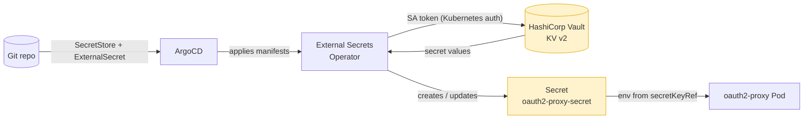
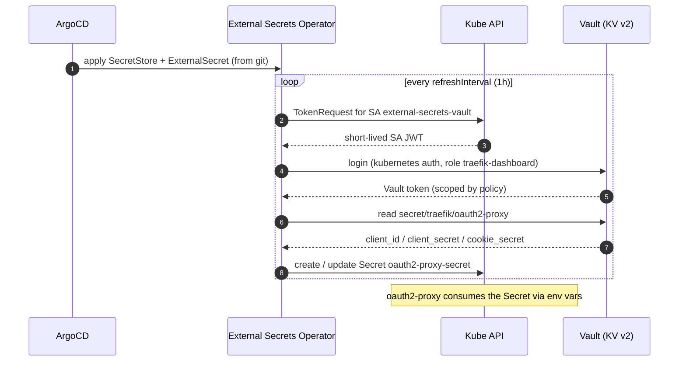

# Secrets from HashiCorp Vault via the External Secrets Operator (ESO)

This is the recommended **GitOps** way to handle the secrets: **no secret
material in git**. You store the values in Vault; ESO reads them and materializes
the Kubernetes Secrets (`oauth2-proxy-secret`, optionally `traefik-dashboard-tls`)
in-cluster. ArgoCD only manages the `SecretStore`/`ExternalSecret` references,
which carry no sensitive data.

Manifests live in [`manifests/vault/`](../manifests/vault/):

```
serviceaccount.yaml                 SA whose token ESO uses to auth to Vault
secretstore.yaml                    SecretStore → Vault (KV v2, Kubernetes auth)
externalsecret-oauth2-proxy.yaml    ExternalSecret → oauth2-proxy-secret
externalsecret-dashboard-tls.yaml   ExternalSecret → traefik-dashboard-tls (optional)
```

Auth model: **Kubernetes auth**. ESO presents the `external-secrets-vault`
ServiceAccount token; Vault validates it and maps it to a role + policy. This
works whether Vault is **internal to OpenShift** or **external** — only the
`server:` address (and CA trust) changes.

---

## How it works

<details>
<summary><b>🗺️ Components &amp; data flow (click to expand)</b></summary>



</details>

> The **only** thing in git is the pair `SecretStore` + `ExternalSecret` (no
> secret material). Vault holds the values; ESO writes the yellow `Secret` into
> the cluster on the fly. ArgoCD never sees the sensitive data.

<details>
<summary><b>🔁 Sync loop — Kubernetes auth (click to expand)</b></summary>



</details>

---

## 0. Prerequisites

- **External Secrets Operator** installed (OpenShift OperatorHub → "External
  Secrets Operator", or the community Helm chart). **Air-gapped:** install it
  from a **disconnected catalog** (`oc-mirror`), see `docs/air-gapped.md` §3.
- **Air-gapped:** Vault is **internal/on-prem** — the `server:` is an in-cluster
  or on-prem address (`https://vault.vault.svc.cluster.local:8200` or an internal
  Route), and its CA must be trusted (see §5).
- **Vault** reachable from the cluster and unsealed, with a token/policy that
  lets you run the admin commands below.
- The `traefik` namespace exists (the Traefik ArgoCD Application creates it).

---

## 1. Internal vs external Vault — what changes

Only the **address** and **CA trust**, nothing else:

| | `server:` in `secretstore.yaml` | CA trust |
|---|---|---|
| **Internal** (Vault runs in OCP) | `https://vault.<vault-ns>.svc.cluster.local:8200` or its Route `https://vault.apps.example.com` | Usually the OpenShift service-serving cert or your own; often already trusted |
| **External** (Vault outside OCP) | `https://vault.example.com:8200` | If self-signed, provide the CA (see §5) |

For **Kubernetes auth to work with an external Vault**, Vault must be able to
validate OpenShift ServiceAccount tokens — i.e. Vault's `kubernetes` auth is
configured with the OCP API server URL and its CA, and (on modern Vault) uses
the cluster's token reviewer / JWKS. That's a Vault-side config, below.

---

## 2. Vault: enable KV v2 and write the secret

```bash
# KV v2 mounted at 'secret' (default on dev; enable if missing)
vault secrets enable -path=secret kv-v2 2>/dev/null || true

# The oauth2-proxy credentials
vault kv put secret/traefik/oauth2-proxy \
  client_id=traefik-dashboard \
  client_secret='<keycloak-client-secret>' \
  cookie_secret="$(openssl rand -base64 32 | tr -- '+/' '-_')"

# (Optional) the dashboard TLS material
vault kv put secret/traefik/dashboard-tls tls.crt=@tls.crt tls.key=@tls.key
```

## 3. Vault: policy granting read access

```bash
vault policy write traefik-dashboard - <<'EOF'
path "secret/data/traefik/*" {
  capabilities = ["read"]
}
EOF
```

## 4. Vault: Kubernetes auth + role bound to the SA

```bash
# Enable the kubernetes auth method (once)
vault auth enable kubernetes 2>/dev/null || true

# Point Vault at the OpenShift API. Inside the cluster, Vault can use its own
# SA token + the in-cluster values; externally, pass the OCP API URL + CA.
vault write auth/kubernetes/config \
  kubernetes_host="https://kubernetes.default.svc" \
  # For EXTERNAL Vault, use the public OCP API URL and its CA instead:
  # kubernetes_host="https://api.ocp.example.com:6443" \
  # kubernetes_ca_cert=@ocp-api-ca.crt

# Bind the ESO ServiceAccount (external-secrets-vault) in namespace 'traefik'
# to the policy. The role name must match secretstore.yaml (role: traefik-dashboard).
vault write auth/kubernetes/role/traefik-dashboard \
  bound_service_account_names=external-secrets-vault \
  bound_service_account_namespaces=traefik \
  policy=traefik-dashboard \
  ttl=1h
```

## 5. (External / self-signed Vault) trust the Vault cert

Uncomment the `caProvider` block in `secretstore.yaml` and point it at a
ConfigMap holding Vault's CA. On OpenShift the simplest is the injected trusted
bundle — enable `oauth2-proxy/trusted-ca-configmap.yaml` in the kustomization and
reference its `ca-bundle.crt`, or create a dedicated ConfigMap with Vault's CA.

## 6. Wire it into the deployment

Enable the Vault manifests in [`manifests/kustomization.yaml`](../manifests/kustomization.yaml)
(uncomment the `vault/` block) and **remove the out-of-band secret step** — you no
longer `oc apply` `oauth2-proxy-secret`:

```yaml
resources:
  # ...
  - vault/serviceaccount.yaml
  - vault/secretstore.yaml
  - vault/externalsecret-oauth2-proxy.yaml
  # - vault/externalsecret-dashboard-tls.yaml   # optional
```

Commit + push. ArgoCD applies the `SecretStore`/`ExternalSecret`; ESO then creates
`oauth2-proxy-secret` in the namespace, and oauth2-proxy consumes it as before.

## 7. Verify

```bash
oc get externalsecret -n traefik
# STATUS should be SecretSynced / Ready=True
oc get secret oauth2-proxy-secret -n traefik    # created by ESO
oc describe externalsecret oauth2-proxy-secret -n traefik   # troubleshoot sync errors
```

## Notes

- **Rotation:** update the value in Vault; ESO re-syncs within `refreshInterval`
  (1h here). To roll the pod immediately after a change:
  `oc rollout restart deploy/oauth2-proxy -n traefik`.
- **Least privilege:** the Vault policy only grants `read` on
  `secret/data/traefik/*`. Keep it scoped.
- **API version:** the manifests use `external-secrets.io/v1` (ESO ≥ 0.14).
  Older operators expose `v1beta1` — adjust `apiVersion` to match your install.
- ArgoCD shows the `ExternalSecret` health via ESO's status conditions; the
  Secret it generates is owned by ESO and not tracked by git.
